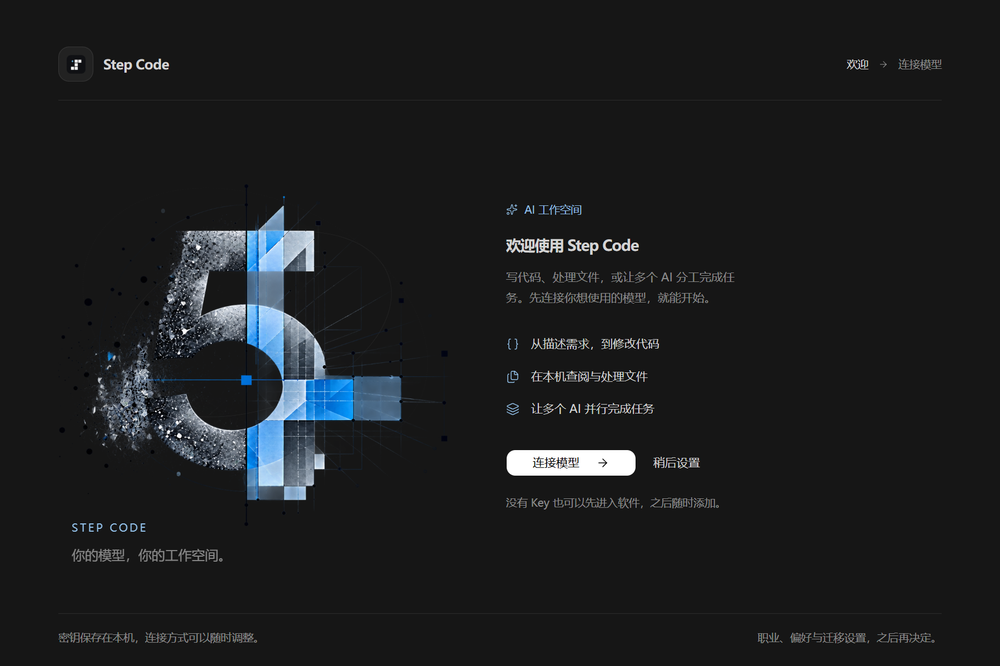
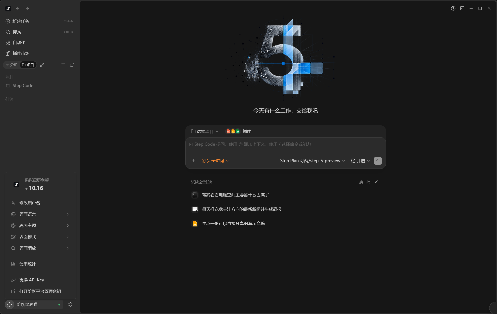
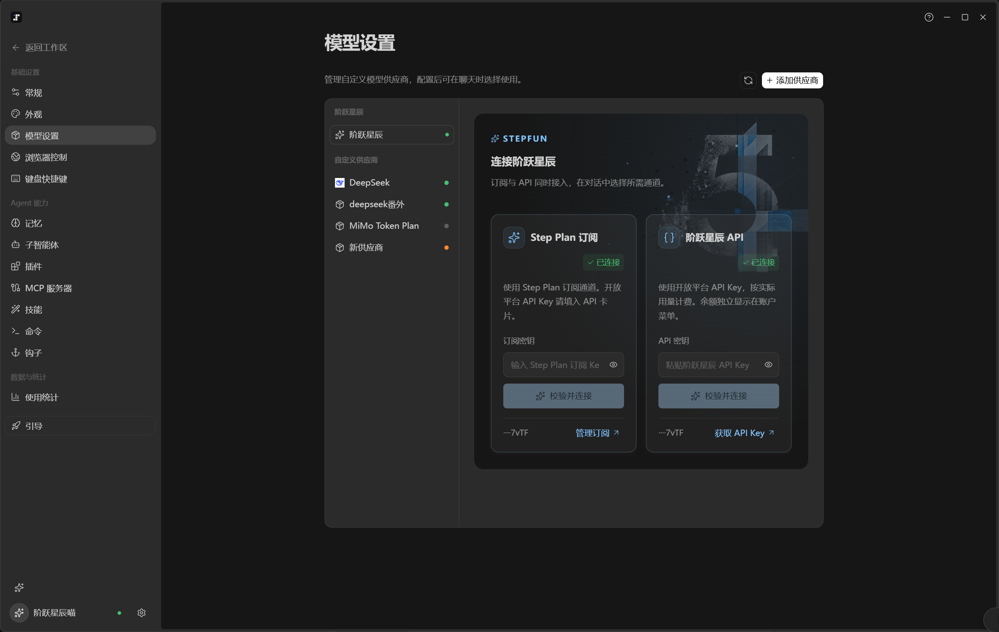
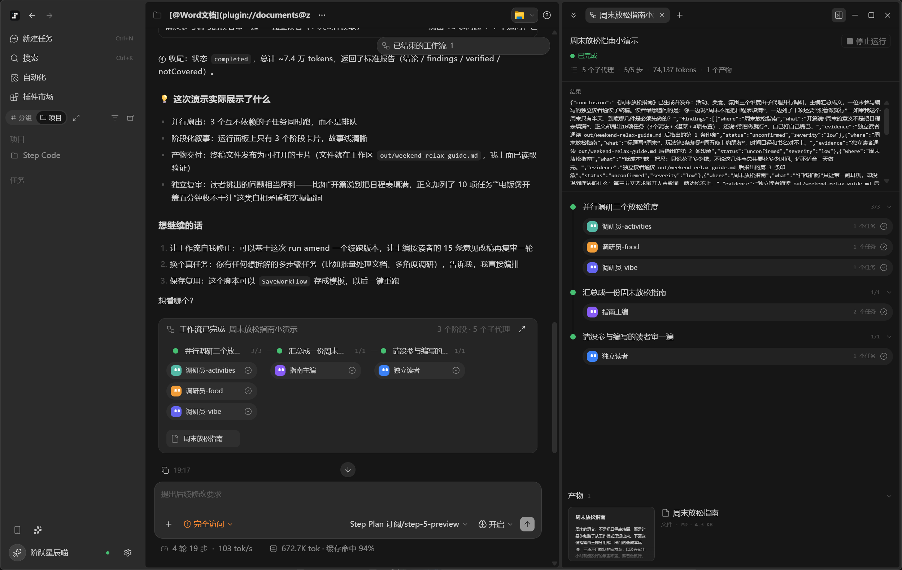
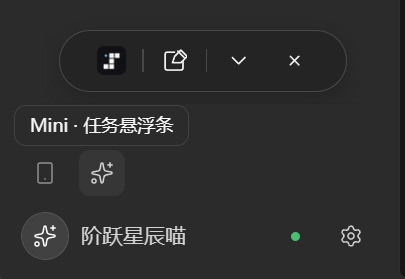
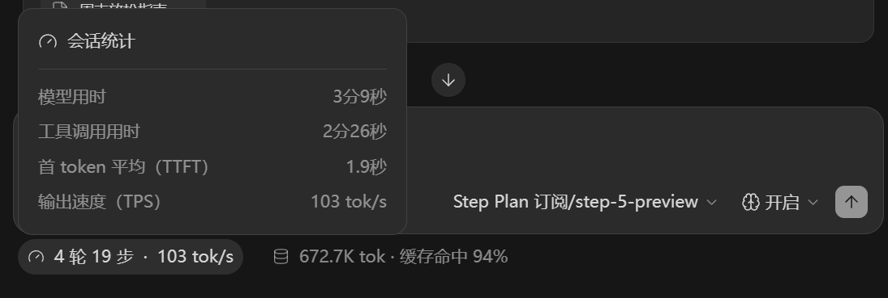

<div align="center">

# StepFun Harness
### Bring AI beyond chat—and into action on your desktop.

**A community-built desktop AI workspace**

[简体中文](README.md) · [Get started](docs/GETTING-STARTED.md#english) · [Licenses](LICENSES.md) · [Issues](https://github.com/abbcreat-cyber/stepfun-harness/issues)


**From a request to tool execution, coordinated agents, and deliverable files.**

</div>



StepFun Harness connects the Step Code agent runtime to a full desktop interface. Models, local files, terminal tools, an embedded browser, plugins, and workflows share one workspace. Use Step Plan alongside API connections and custom providers, and follow tasks through their progress, parallel agents, and final artifacts.

> **An independent community project, not an official StepFun, Z.ai, DeepSeek, or OpenAI product.** Windows x64 installer and source code are provided. Core code is open source; bundled plugins retain separate licenses. Four original document skills have non-commercial restrictions. See [LICENSES.md](LICENSES.md).



## More than a chat window

| Capability | What it gives you |
|---|---|
| **Subscriptions and APIs together** | Step Plan, StepFun API, and custom providers in one model picker. |
| **Local tools and an embedded browser** | Work with files, run commands, and interact with web pages through the adapter. |
| **Visible multi-agent workflows** | Inspect phases, parallel tasks, status, and artifacts; save workflows for reuse. |
| **Bundled document plugins** | Word, PDF, presentations, and spreadsheet skills with supporting assets; activate with `@plugin`. |
| **Mini task strip** | Follow active tasks and counts outside the main window. |
| **Unified updates** | App updates come from this GitHub repository. Step runtime upgrades are integrated and tested before shipping with the app. |
| **Session statistics** | Model/tool time, first-token latency, output speed, tokens, and cache usage. |
| **Two built-in hooks** | First-principles reminder and opening explanation, enabled by default and independently configurable. |
| **Interactive and continuing work** | Structured questions, follow-up messages, cancellation, and persistent scheduled tasks. |

### Connect the model you need

Choose a subscription or API connection without switching apps. Custom providers support OpenAI Chat Completions, OpenAI Responses, and Anthropic Messages. Capabilities still depend on the model and service.



### See collaboration happen

Research in parallel, consolidate an artifact, and ask another agent to review it. The panel exposes execution state, phases, and deliverables.



### Keep tasks within reach

The Mini strip keeps active tasks, task counts, and execution status within reach outside the main window. Expand it to follow progress.



### Understand time and usage

See session timing, response speed, token consumption, and cache usage to understand how each task runs.



## Get started

1. **[Download the Windows installer](https://github.com/abbcreat-cyber/stepfun-harness/releases/latest)** (`.exe`).
2. Run the installer and choose a destination. It creates the **阶跃星辰** desktop shortcut with the project's star icon.
3. Open the shortcut and connect your own subscription, API key, or custom model.

**No separate Node.js, Python, Git Bash, or Step CLI setup is required.** The installer includes the real Step runtime, adapter, document libraries, a lightweight Office engine, both built-in hooks, and plugins. Bring your own model account and credits.

For source development:

```powershell
git clone https://github.com/abbcreat-cyber/stepfun-harness.git
cd stepfun-harness
corepack enable
corepack prepare pnpm@10.33.2 --activate
pnpm install
pnpm harness:doctor
pnpm harness:dev
```

See **[Get started](docs/GETTING-STARTED.md#english)** for data locations, source development and installer builds.

## Plugins and hooks

- Built-in plugins cover Word, PDF, presentations, spreadsheets, browser operations, and skill creation. Use `@plugin` to select the capabilities your task needs.
- **First-principles reminder:** identify goals, facts, and constraints before deriving and verifying a solution.
- **Opening explanation:** explain the goal and first step before using tools, making tasks easier to follow.
- Both built-in hooks are enabled by default and can be toggled independently in settings.

## Architecture and contributions

```text
Desktop UI → Host / Services → stepcode-adapter → Step Code RPC
                                    ↓
                       Local tools · Browser · Plugins · Workflows
```

Our focus is connecting UI and execution faithfully: inputs, tools, interactions, events, cancellation, state, and artifacts. Reproducible reports and focused patches are welcome. Never include credentials or private conversations in issues.

[Contributing](CONTRIBUTING.md) · [Build and release](docs/BUILDING.md) · [Third-party notices](THIRD-PARTY-NOTICES.md)

## Acknowledgments

- **[ZCode](https://github.com/zai-org/ZCode)** — the desktop interface, engineering foundation, and upstream plugin/workflow capabilities.
- **[Step Code](https://github.com/stepfun-ai/Step-Code)** — the actual agent runtime and RPC. Derived adapter files preserve its MIT notices.
- **[DeepSeek Harness](https://github.com/deepseek-ai/deepseek-harness)** — inspiration for harness workflows and product capabilities.
- **[Codex](https://openai.com/codex/)** — references for task interactions, Mini, and progress communication, plus development assistance.

Thank you for helping the community build more useful AI tools.

## Follow the creator

Enjoying the project? Find me on Douyin to chat about AI tools and open-source tinkering.

**琳如烟～AI工程师** · Douyin ID: **`linruyan888`**

Search for this ID in Douyin or scan the code below. On mobile, save the image and open it in Douyin's scanner.


