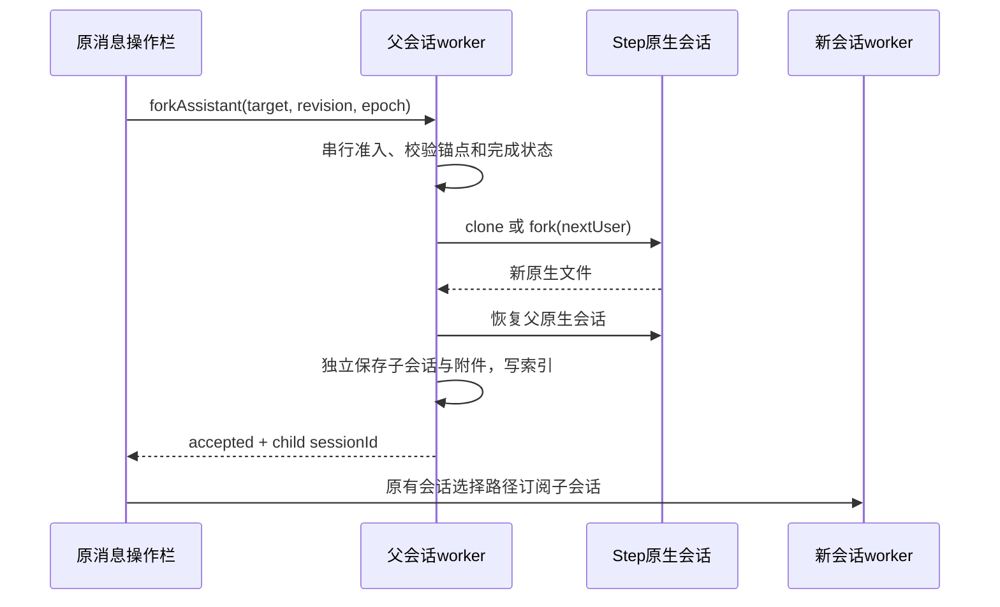

# 消息操作栏分叉为独立会话

原前端已提供 `forkAssistant` 回调和“分叉”图标，但社区适配层声明 `forkNotWired`，且没有命令处理器。此前优化的原生 fork 是编辑/重试撤回历史所用，不等于本功能。

复用原消息操作栏、CAS 命令和 session 选择路径：完成轮的最终 assistant 显示分叉；点击创建新的桌面会话，包含选中回复及之前的历史，保留模型/权限/项目和附件，原会话及工作区文件不改变。正在运行、排队或有后台工作时不进行切换式原生操作。

原生 RPC `clone` 复制当前分支，`fork(nextUserEntryId)` 保留下一条用户消息之前的内容。仅绑定能在当前原生分支准确定位的轮尾回复，不能按行号猜原生 entry。历史用户绑定按顺序核对正文；已有绑定复用。完成态维护行级 `canFork`，冷历史补齐旧投影。

优化边界：一次线性索引构建映射，不对每条历史反复扫描；只复制选中轮及之前的行和其引用的附件；重复 commandId 回放同一子会话；点击期间禁用同一 UI 入口。父进程不持有子会话后续状态。失败不切 UI，不写成功 ACK；原生切换失败重置 client，下一次从父持久化文件恢复。新会话不继承待执行队列、工作流运行状态或可撤销文件检查点权限。

验收：最新及较早回复分叉、冷历史入口、同文重复轮、错误目标、重复命令、取消/持久化失败、原会话继续发送、子会话独立续聊、附件可读与子会话重载。使用订阅模型进行有界小任务前端实测；用户随后授权所有修复完成后统一发布。
