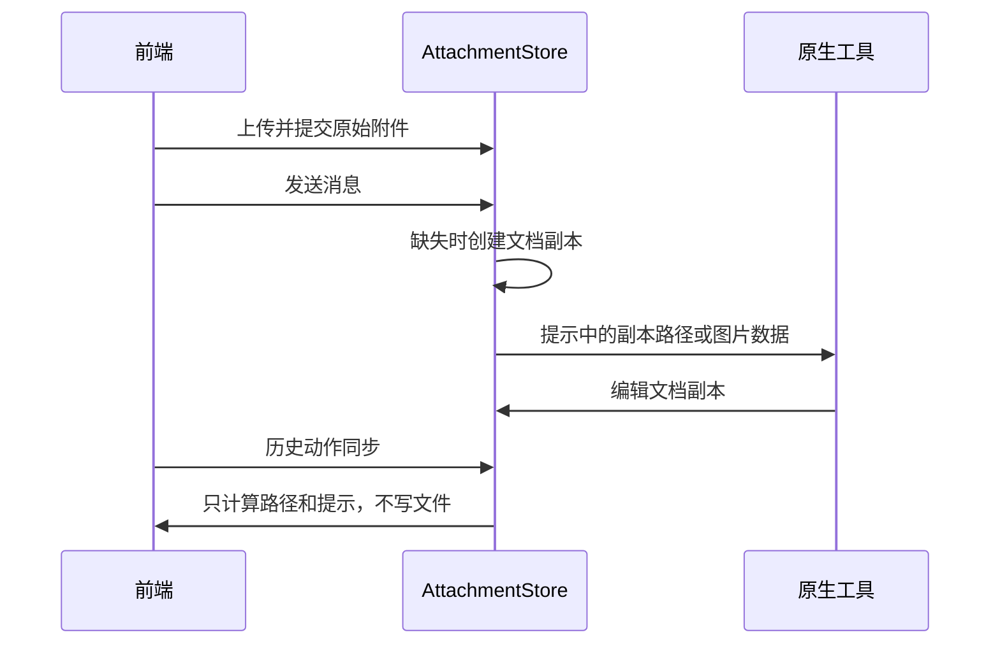

# 附件副本生命周期

- AttachmentStore 拥有会话附件原始上传（`.bin`/元数据）与供工具访问的文档副本（`.file.ext`）。原始上传保持不变，工具允许编辑副本。
- 发送和重试准备文档时只创建缺失副本，已有副本不覆盖；并发准备同一路径共享一次创建，创建失败允许重试。
- 历史动作同步只生成相同的附件提示文本，不重新物化文件，不读取/编码图片，不因查看历史恢复已删除的副本。
- 文档已上传时使用持久元数据构建提示；只有新物化需要复制原文件，重复准备不反复读整个文档。绝对路径附件仍按实际内容生成身份，保留原有语义。
- 缺失上传、无效类型/超大文件仍明确失败；目标为目录时拒绝，不假装准备成功。
- 原生工具、前端上传及历史预览协议不变。图片发送仍读取原始图片，历史计算不发送图片，不改变真实发图能力。

验收：实际编辑附件后重复准备、重启、历史同步仍保留修改；历史同步不复活删除的副本；图片历史同步不读取图片字节但正常发送仍验证读取；并发准备返回完整相同路径；冲突目录拒绝；Step Plan 通过前端上传并修改附件，完成后回读及界面撤销均核对磁盘。
