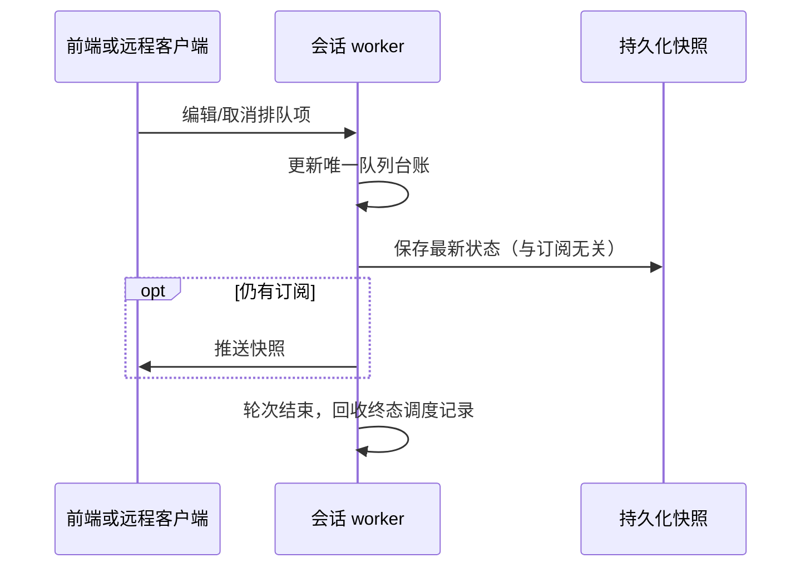

# 后台队列保存与调度台账回收

- 会话 worker 是运行状态和队列的唯一所有者。前端是否订阅只决定是否发帧，不能决定是否保存已接受的队列状态。
- 活动会话广播时先沿已有快照持久化路径保存，再根据订阅发送。读取其他会话的冷快照不保存当前会话；保留现有磁盘忙重试策略。
- InputLedger 是待调度/归属台账，不是聊天历史或命令 ACK 去重库。已 attributed、failed、cancelled 的项在新准入前和轮次结束时移除；pending、submitted、queued、steered 必须保留至现有状态机证明结束。
- 未知投递结果 submitted 不能因内存回收被删除或自动重发。晚到 ACK 不得复活完成项。用户历史保留在 conversationRows，ACK 去重保留在现有命令处理器。
- 用户已经请求停止时，原生 shell 工具返回明确的 `Command aborted` 错误结果，应显示已取消；其他工具错误、非取消错误、成功结果保持原状态。不得把整轮所有失败一律当作取消。

验收：无订阅的编辑、取消、排序状态落盘并可恢复；冷历史读取不串写；连续千轮台账大小不随历史累积；未投递队列、未知投递和晚 ACK 的行为保持；桌面连续流及手机可恢复流回归；真实 Step Plan 小任务验证运行中排队、取消、停止和继续。
