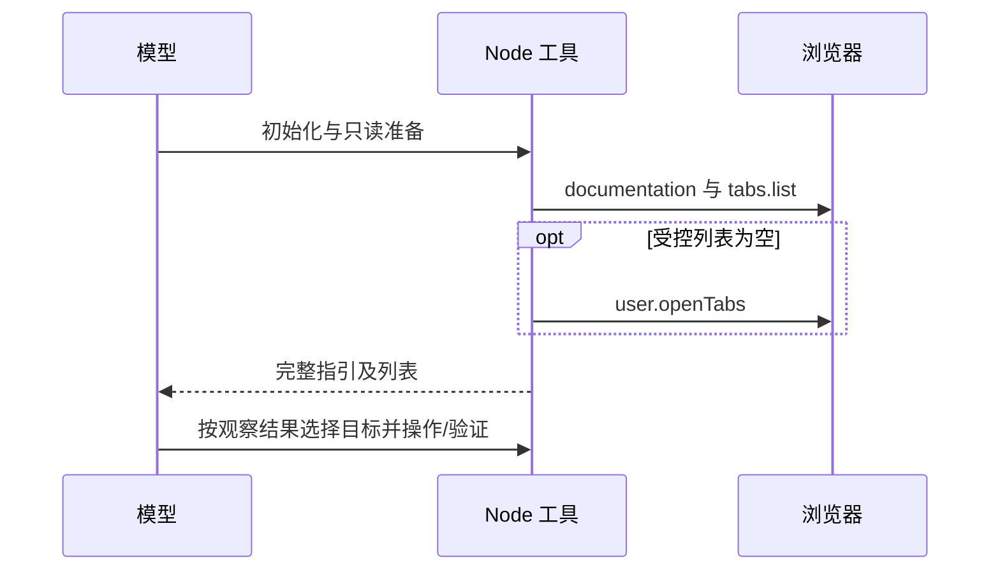

# 浏览器启动只读信息合并

## 基线与目标

同会话续发约 84–110ms 进入消息界面，prompt 投递约 50–57ms；新会话底座启动约 1.8–2 秒。浏览器简单读取任务却用了 3–5 次 Node 调用，API 指引、受控标签和用户标签被拆成多个模型往返。本轮合并这些只读准备，不修改模型、思考档位、底座、权限或目标确认规则。

## 规则与所有者

browser-use 的 SKILL.md 拥有首次准备顺序。首次调用完成 bootstrap、后端选择、完整指引和完整 controlledTabs 输出；列表为空时同次输出 userTabs。模型看到结果后，下一调用才选择、创建或导航目标。已有受控标签不匹配时，仍须观察用户标签。目标不确定、状态失效和弹窗仍走既有重新观察流程。只读任务获取完整目标数据后结束，不额外做与结果无关的清单查询。

## 迁移与验收

复用官方插件刷新入口，仅对归一化哈希命中已知旧版的官方技能做原子替换；保留安装的技能命名空间、自定义正文和启停状态。无新缓存或协议变化。

同一订阅模型和页面任务进行有界前后对照，记录总时间、工具次数及本地工具耗时；网络/模型波动单独报告。迁移测试覆盖旧版、重复执行、用户编辑与第三方声明。只有可重复减少的往返才保留，不宣称本轮消除了底座冷启动。
