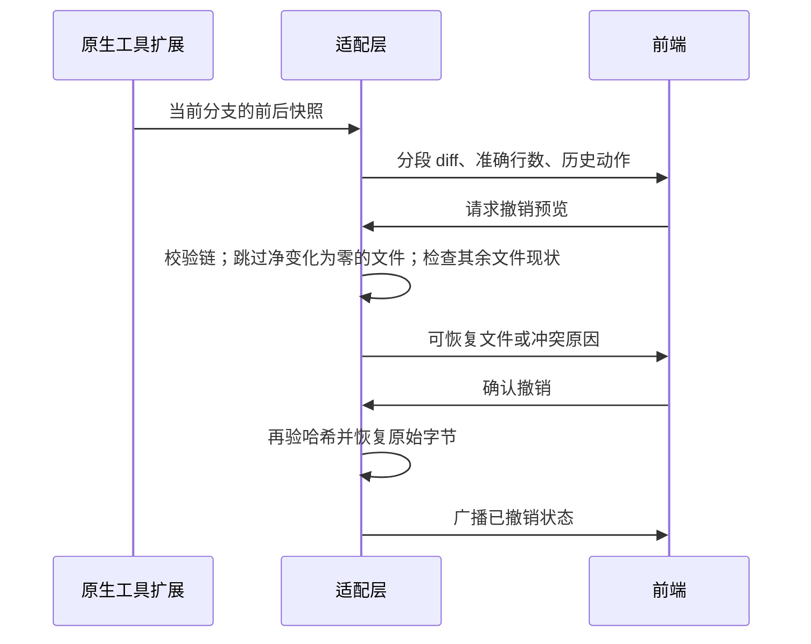

# 文件变更摘要与无变化撤销

## 规则

- 原生工具扩展记录执行前后字节快照；适配层从当前原生分支计算摘要，前端沿用文件摘要、差异预览和撤销确认入口。
- 同一文件多处修改应分段显示，未修改的中间行不计入增加/删除。换行符或末尾换行变化也必须可见。
- 差异计算有工作量上限，超限采用有效但非最小的整段替换，不能阻塞会话。快照及恢复仍逐字节校验，不使用展示 diff 恢复文件。
- 完整且连续的检查点链，如果执行前后哈希一致，撤销不触碰该文件，也不因该文件随后被外部编辑而阻塞其他文件。缺失、重叠、错误或不连续的快照仍阻止撤销。
- 不完整快照不生成“0 个文件”的活动摘要或撤销入口；重新同步时清理过期的活动摘要，保留已撤销记录。

## 验收

覆盖分散编辑、插入/删除、重复行、换行变化、工作量上限、随机补丁重建；无变化文件外部编辑不阻塞其他文件，真正冲突和不完整快照仍拒绝。使用 Step Plan 小任务在隔离桌面真实编辑两个远隔位置，通过 UI 查看差异和撤销，核对磁盘内容与历史状态。
