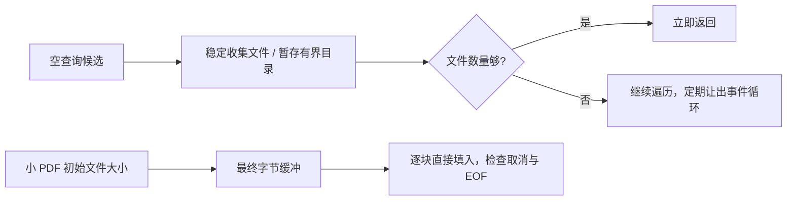

# 默认文件候选与小型 PDF 读取优化

- Host 空查询仍按“文件优先、同类保持原顺序”返回候选。得到足够文件即停止遍历；目录候选最多暂存 limit 项，只有文件不足才补目录。每遍历 2048 项继续让出事件循环。非空模糊搜索和非有限 limit 沿用原算法。
- 小型 PDF（既有 2MiB 阈值以内）预览直接写入一个最终字节缓冲，不保留所有块再拼接。每次读取长度不超过剩余文件长度，文件增长部分等待既有文件变更刷新；短读继续，EOF 截断返回实际已读字节供 PDF 解析器判断，取消后不继续请求，错误仍向上传递。
- 不变更大 PDF 分段通道、旧 Host 回退、256KiB 分块、权限或底座。搜索仍在 service，PDF 仍通过 IFileService 的既有 readFileRange 读取；无新缓存和 RPC。

回归对比旧排序结果、文件/目录混排、空/小数/零 limit、非空模糊搜索及提前停止读取数；PDF 验证字节完整、短读、EOF、取消、异常、尾部边界。大项目候选测量只报告 Host 算法耗时，不等同于整个界面耗时；用真实软件文件搜索和订阅 PDF 小任务验收。
