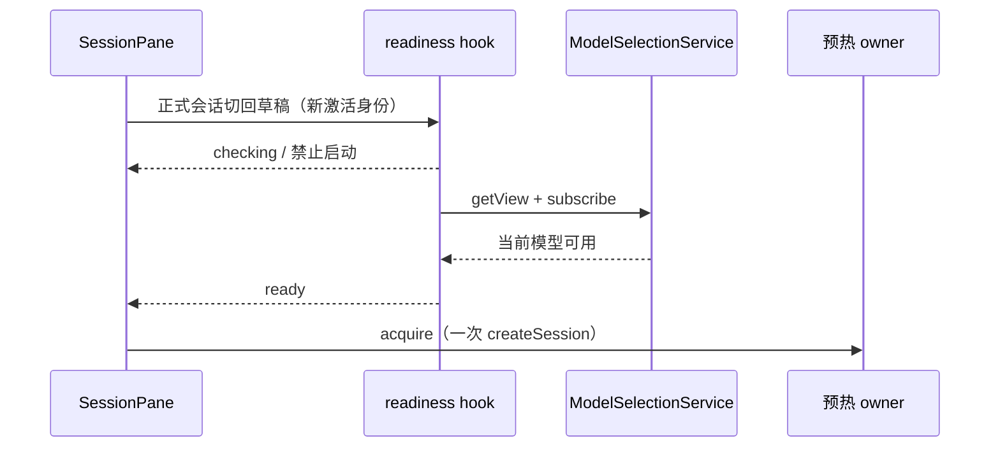

# 草稿就绪校验按本次激活隔离

## 问题与目标

同一 SessionPane 从正式会话返回草稿时，useDraftModelReadinessGate 曾沿用正式会话期间的 ready。首次 render 先允许预热，effect 再写 checking，导致已启动的空会话被回收，检查通过后重新创建。真实运行观察到 create → 约 13ms 后 retire → 等待原创建结束 → 再 create，多消耗一次约 2 秒的底座启动。

## 规则与所有者

- readiness hook 是校验状态唯一所有者；状态绑定 workspace/provider、启用状态与 modelSelectionService 实例组成的本次激活身份。
- 正式会话切回草稿、切 workspace/provider 或替换 service 时，旧 ready 不能允许新草稿启动；首次 render 即 checking，直到该次读取或变更事件返回。
- 未配置模型继续禁止启动，读取失败继续沿用既有 check-failed + Host 权威校验；发送时仍重新校验，不增加配置缓存。
- 旧激活的异步回包不能成为当前激活的就绪证明。事件优先于更早发起的读取。校验退出时取消订阅。
- DraftSessionPrewarmCoordinator 仍唯一拥有预热创建、提升、回收和未确认投递边界。不添加超时来掩盖状态错误，不跨会话复用原生进程。

## 验收

浏览器真实 React hook 测试覆盖正式会话返回草稿、workspace/provider/service 切换、延迟读取、事件抢先更新、无模型及读取失败。集成同一订阅模型小任务，对比立即发送与等待预热，统计启动数、回收数与用户消息上屏时间；不把模型回复总时间当成本地优化效果。Desktop continuous 与 mobile replayable 共用此前置 gate，协议/owner/lease/重放规则不变。
