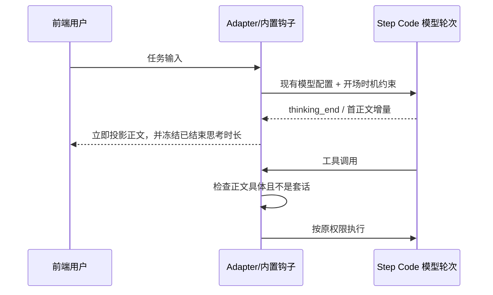

# 有内容的早期开场与准确思考时长

## 证据与目标

目标是让需要执行的任务尽早出现模型针对该任务写的目标和下一步，不能以固定回复或伪造进度替代。样例会话第三轮首个模型 token 约 1.18 秒，首正文行约 62.53 秒；首 assistant 响应总用时约 92.86 秒。现有钩子仅阻止静默工具调用，不能约束开场前规划；投影还在 message_end 重算已经结束的 reasoning，造成显示 92 秒。

参考 OpenAI Codex 公开模型提示中的 preamble 原则：工具前简短说明具体下一步，聚合相关动作。该公开行为规则不等于私有调度实现，不宣称复刻未知机制。

## 行为

- 开场钩子开启时，在原生模型请求前注入独立的时机约束：复杂任务先识别目标和确实可做的第一步，先输出简短正文，再展开详细实现规划和长代码/工具参数。不能先完成全套设计才开场，不能为了开场多做无关查询。
- 原句复测表明仅有提示仍可能超过120秒无正文，不能视作完成。对声明 disabled/off 映射的 OpenAI-compatible 推理模型，首个任务请求改为同一 agent 轮次内的两个阶段：同模型、同凭据生成最多768 token的无工具开场，再使用原思考档位执行主任务。只限制开场阶段，不修改主任务选择。部分服务声明关闭推理后仍消耗推理 token，160 token 的小上限曾导致无正文而截断，因此不能把它设得过低。
- 开场最多一次、8秒超时，失败/空话回退主任务，不自动重试开场。沿用用户取消信号，取消后不得启动主请求。问候/纯问答、关闭钩子、只要结果和不支持关闭推理的供应商保持原路径。此阶段会增加一次很短的API请求；不能宣称零额外调用。
- 开场由模型生成而非模板；原生公开事件流只拼接真实正文，调整后续内容索引并合并两次实际usage，保存到同一assistant历史。不创建第二套任务/队列，不新增user消息。暂限 OpenAI-compatible 路径，避免改变其他协议的签名思考布局。
- 内置订阅可能有桌面 provider 绑定但没有 optionSpecs 映射，不能漏掉这条路径。对这类 OpenAI-compatible 且原生声明 reasoning 的模型，开场使用 SDK 非推理选项及输出上限，主请求保留原 model/context/options。自定义映射走它声明的 disabled/off 配置。没有桌面绑定的外部原生供应商保持直通，避免替换第三方扩展自己的执行器。两条受支持路径均不按模型名字写分支。
- 钩子工具准入只接受有内容的正文，常见纯“收到/正在处理/请稍等”套话不算。用户明确只要结果/JSON 时沿原豁免；开关关闭不注入时机约束。
- reasoning 块首次结束后固定 durationMs；后续 message_end/工具参数结束不延长已完成思考。无 thinking_end 时，首个正文或工具块标记上一个 streaming reasoning 结束；新 reasoning 块独立计时，中止保留实际结束时间。

## 验证

模拟 thinking_end→正文→长工具参数→message_end、缺 end、中止和多 reasoning 块；钩子开启/关闭、格式豁免、重复注入和无意义开场。真实 Step Plan 任务使用正常用户表达，不在测试提示中额外要求先说明；观测发送、首 reasoning、首正文 DOM、首工具及最终结果，保留波动与失败记录。旧会话时间不能假装为新实现实测；不修改旧正文和历史数字来制造提速。

## 第二模型验收发现的兼容边界

用户追加授权使用腾讯 WorkBuddy 的 DeepSeek。其网关发送增量 tool arguments 后，再发送同一完整参数快照，原校验器把完整 JSON 重复拼接为无效文本。只对“delta 与已收集 raw 逐字相同，且 raw 已是完整对象 JSON”去重；冲突的第二个对象、重复残片、超限内容仍拒绝。不按供应商或模型名字匹配，不修改外部网关，不绕过工具参数完整性检查。
