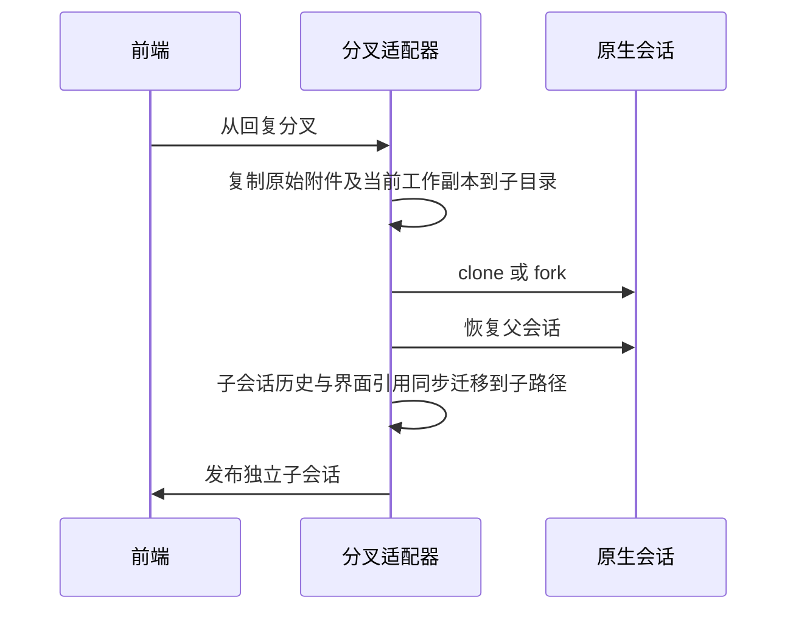

# 分叉附件与历史路径一致性

- 分叉仍复制对话，不回退共享项目工作区。会话私有附件副本以分叉当时的实际内容为准，不承诺恢复到历史回复时的文件状态。
- 原始附件 `.bin` 与元数据用于原始预览，保持原样复制；已经被工具修改的 `.file.ext` 副本单独复制到子会话，不能重新从原始上传生成。原副本已删除时，分叉保持缺失，不能悄悄复活。
- 仅迁移当前继承消息所引用的会话私有附件路径。原生用户附件清单、助手工具参数/结果、检查点路径、前端继承行同步重映射；共享工作区路径、其他文件及父会话记录不改写。
- 同时识别已知路径的 Windows 分隔符及正斜杠形式。按路径边界替换，避免误替换同前缀但不同扩展名的文件。
- 新会话继续沿已有工作区和模型配置。分叉失败不发布成功结果、不修改父会话；沿既有失败回滚清理新附件目录。

验收：修改过的附件分叉后内容一致；子会话修改不影响父副本/原始上传；原生和 UI 记录没有残留的已知父附件路径；路径近似但不同的文件不被误换；删除的副本不复活；真实底座分叉恢复与真实 Step Plan 分叉后续编辑通过。
