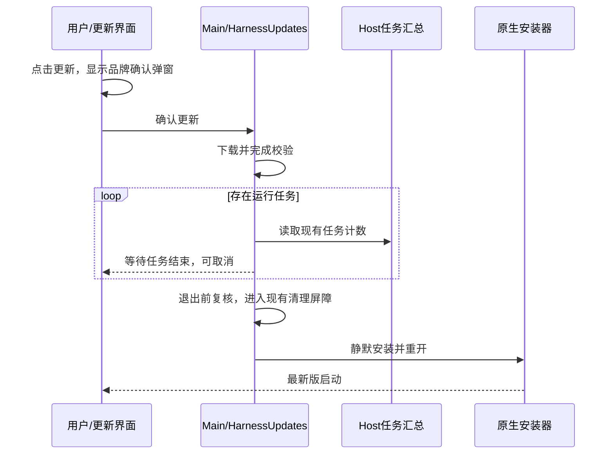

# 确认一次后自动更新

用户点击“更新”打开品牌确认弹窗，点击弹窗内“更新”后，由 Main 接管下载、校验、等待任务、退出、静默安装和重新打开。中间不再要求用户确认。仅检查版本不授权下载或安装。

## 状态与所有者

- `HarnessUpdates` 是自动安装意图、下载和安装阶段的唯一所有者。Renderer 通过既有 `manageHarnessUpdate` 接口发送命令并读取快照；关闭面板不取消流程。
- 沿用 `download` 命令，其含义变为下载并自动安装；兼容已缓存包的 `install` 命令。下载成功事件只标记已校验，必须等待 downloadUpdate promise 成功后才安排安装，校验失败不能安装。
- `HarnessUpdateItem.installPhase` 表达等待任务或正在安装；运行任务数量来自 Host 已有汇总，不读取 DOM/Mini 作为业务状态。取消下载、等待阶段取消、下载错误和安装错误都撤销本次自动安装意图。
- 多窗口重复命令、重复 downloaded 事件不能重复启动安装。等待任务阶段每秒复核已有任务计数，忙时不进入退出屏障。安装前再次核对计数。缺少有效计数或读取失败不得视为空闲。
- 进入退出屏障后不可取消，沿用已有 Host/Agent 清理流程。Windows 用 `quitAndInstall(true, true)` 静默安装并强制重开；底座仍随整包更新，不新增底座独立升级入口。
- 下载失败保留可重试入口；安装失败不无限自动重试。进程重启不恢复未经再次确认的安装意图。

## 交互

确认框采用现有星辰图标、主题 token、大圆角、标题和正文，右下角横排“取消”“更新”，窄窗口保持两按钮同排。标题为“现在更新阶跃星辰 Harness？”；正文说明自动安装重开、有任务则等结束。中英文与浅深色均一致。Escape/取消不发下载命令；确认仅发一次。

进度页保留真实字节与下载速度；下载/校验阶段说明完成后自动重启；等待时展示任务数量；安装阶段禁用重复操作。网络或用户取消后不会在后台意外重启。

## 验收

验证一次确认完整状态链、忙转闲、等待取消、取消后的迟到事件、重复点击、校验失败、安装失败与显式重试、未知任务状态。验证生产渲染的中英文浅深色确认弹窗和点击次数；后台验证原生安装参数及重开结果，不使用虚拟机或用户鼠标。
