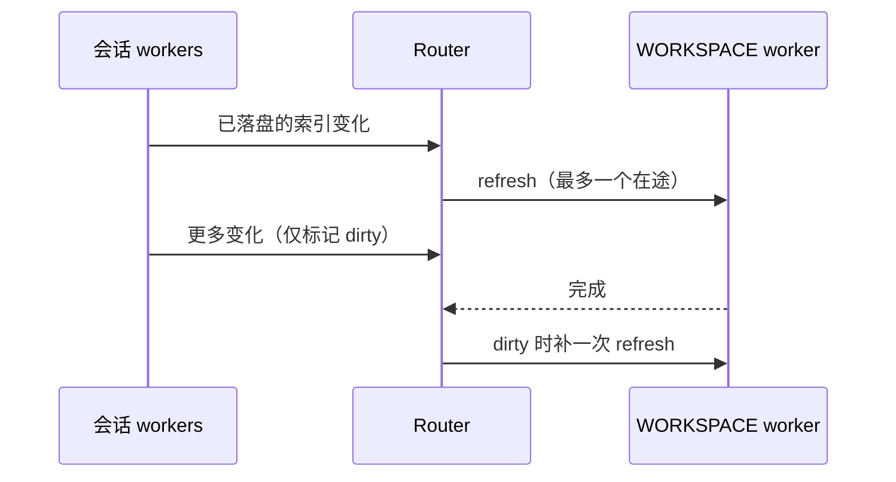

# 索引通知合并与统计恢复复用

## 范围与所有者

仅修改 Harness adapter，不改 Step Code 底座、模型配置或前端协议。会话 worker 仍独占会话事实；WORKSPACE worker 仍拥有列表订阅及序号。Router 只合并通知，不缓存列表内容。

首条通知立即刷新；刷新期间的通知合并为后续一次，不能吞最后一次落盘变化。后续刷新期间再次变化，仍补一次。worker 退出/错误或 Router 关闭后不再发送，旧 worker 的完成回调不能触发新 worker。没有 WORKSPACE worker 时保持原行为；新订阅仍读取完整快照。失败响应结束当前在途请求，无新通知时不重试。桌面 continuous、手机 replayable、ACK/initial 顺序、actor owner 及跨连接流控不变。

统计恢复首次读取的 conversation 同时用于定位原生账本和初始化统计，正文最多读一次。统计 Map 仍是唯一内存账本；已存在的统计不覆盖，原生账本补账、稳定消息去重、时长恢复、单次加载缓存与异常语义保持。未找到或损坏的 conversation 不触发第二次读取。

## 验收

- 突发 100 条索引通知：未响应时仅一次请求，响应后补一次，安静后不刷新；末尾通知仍会处理。
- 不同会话的通知合并；正常连续两次变化不会漏；失败响应、worker 关闭/错误/替换、Router 关闭均无旧回调重发。
- 统计首次恢复读正文一次；并发恢复共享加载；保存统计与原生漏写响应正确合并；已有内存统计保留；缺失/损坏及尾部不完整 JSONL 兼容。
- 候选软件用 Step Plan 订阅同时运行两个小任务，验证列表、Mini 活动数、终态及历史统计恢复。
