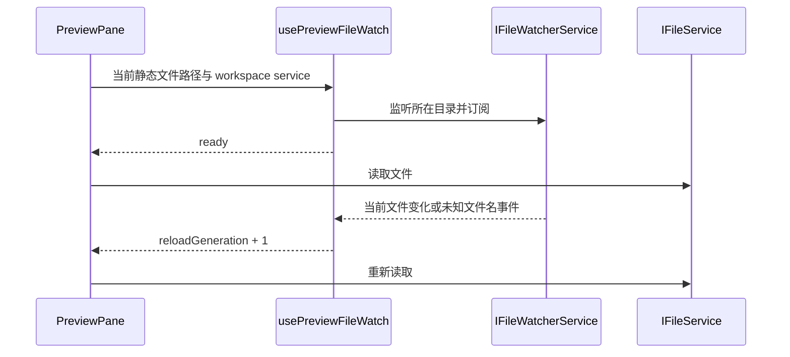

# 已打开文件预览随文件变化刷新

## 问题与行为

实测 Markdown 在外部写入、AI 下一轮再次编辑后，磁盘已经更新但预览仍保留首次打开的旧内容。原先只有 PPTX 订阅目录变化。所有静态文件预览（文本、代码、图片、PDF、Office、PPTX）应复用同一监听入口；音视频播放和历史 diff 不纳入自动重载，避免打断播放或改写历史语义。

## 所有者与顺序

文件系统是内容事实来源，Host 的 IFileWatcherService 持有原生 watcher，UI 的 usePreviewFileWatch 只拥有当前路径和 service 对应的订阅代数；PreviewPane 通过现有 IFileService 读取内容，不添加缓存或新 RPC。

- 监听建立后再首次读取，消除首次读取和订阅之间的遗漏窗口。
- 目录内其他文件的变化不重载当前预览；Windows 路径大小写和分隔符归一化。
- 原子替换、删除、重建均由目录监听处理；删除显示已有文件不存在提示，重建可以恢复。
- 同一文本文件刷新时保留已挂载内容和阅读位置，读取成功后替换；失败时清除旧内容并展示错误。切换文件仍重置阅读位置。
- 切换路径、workspace service 或卸载时取消订阅；迟到的旧订阅注册结果应释放，旧读取结果不得覆盖新预览。
- 监听失败仍允许首次读取和重新打开；不伪造成功或轮询重试。
- 桌面与远程 UI 共用现有 workspace service 路由；不改变 desktop-continuous / web-remote-replayable 会话协议。
- 无数据迁移，不改底座、不改变文件内容或任务历史。

## 验收

1. 打开 Markdown、JSON 后外部写入，当前预览更新。
2. 订阅模型真实任务生成文档，打开预览，再次编辑同一文件，预览显示第二版。
3. 打开图片后替换源文件、删除并重建文本，预览反映当前状态。
4. Hook 回归覆盖无关文件、同路径更换 service、迟到注册、监听失败、取消清理。
5. 混合附件顺序与内容、问答自由输入及返回修改继续通过。
