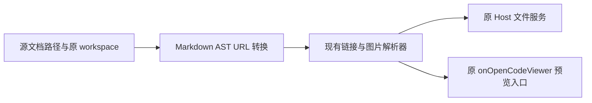

# Markdown 文件内的相对链接与图片

## 规则

实测子目录 Markdown 的相对图片打不开，同目录和上级目录文件链接不能打开。原因分别是以 workspace 根目录解析文档资源，以及 MarkdownPreviewContent 没有接上现有 onOpenCodeViewer。

- 文件预览的相对 URL 以文档所在目录为基准，包括裸文件名、`./`、`../`、图片及引用式链接。
- 路径归一后仍须位于原 workspace 中；不放宽原有 workspace 回退边界。
- 绝对路径、外部 URL、锚点保留原有规则；普通聊天 Markdown 没有 documentPath 时行为不变。
- 文件名只解码一次，保留字面 `%23`，正确处理中文、空格与 `%23` 表示的井号。
- 使用原 workspacePath、workspaceIdentity、remoteSessionId 路由，不能把文档目录变成 workspace 身份。
- 不修改源 Markdown，不改底座，不添加缓存、RPC 或第二套文件读取入口。

## 数据流

源文件路径由 PreviewPane 所有；纯 AST 转换只计算 URL。路径变化参与渲染 memo/key，旧路径结果不能复用到新文档。异步读取继续使用已有卸载与过期结果保护。

Streamdown 的 processor 缓存按插件名和序列化选项区分；必须使用具名插件和显式 workspacePath/documentPath 参数，不把路径隐藏在匿名闭包中。否则可能复用普通聊天或其他文档的 processor。

## 验收

同目录链接、上级目录链接、带编码文件名的图片、引用式链接通过；同名根目录诱饵不能被打开；聊天链接原规则、workspace 身份及路径回退边界不变；真实订阅模型生成相对资源文档后可打开预览。
