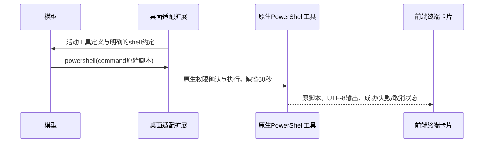

# Windows 原生 PowerShell 工具接入

原会话中模型给出的 `$s`、`$_` 和反斜杠在原生历史与前端参数中一致；失败发生在 Git Bash 解析 `powershell -Command "..."` 或未引用的 `-File D:\...` 时。PowerShell 输出又按默认代码页进入 UTF-8 通道，产生乱码。不能通过修改展示文本或猜测补回变量修复。

当前随包 Step 0.1.3 已注册原生 `powershell` 工具，但默认活动工具集没有启用。接入此工具，执行、UTF-8 输出、截断、权限确认、超时与取消继续由原生底座拥有，不另建 shell 执行器，也不自动重放失败命令。

Windows 桌面扩展只在工具表确有 powershell 且当前允许 run_command 时补充启用，不改变 Linux/macOS 或显式限缩的工具集；会话启动与每轮开始时保持一致。模型约定：Windows 查询、COM、PowerShell 管道使用 powershell 的 command 原始脚本，不能再套 powershell -Command；run_command 保留 Bash 和后台任务。两者默认前台期限均为 60 秒，PowerShell timeout 单位为秒。

已知危险的跨 shell 引用（未转义 $ 的双引号 -Command、未引用的反斜杠 -File 路径）在实际执行前明确拒绝，提示原生工具入口；合法单引号/EncodedCommand/正确引用的路径不改写。前端保留原始脚本，将 PowerShell 纳入已有终端展示与权限展示。文件检查点将 PowerShell 与其他 shell 一样视为不支持自动回滚的副作用，不误启用撤销。

验证：真实底座与本地固定响应重现变量/路径错误，再确认原生 PowerShell 正确保留 `$`、`$_`、中文、路径与非零退出；权限拒绝不得写文件、超时和取消须终止运行。用 Step Plan 小任务在真实界面读取临时快捷方式或文件，检查模型实际工具选择和终端卡片。仅本地部署和提交，未获得本轮云端发布授权。
