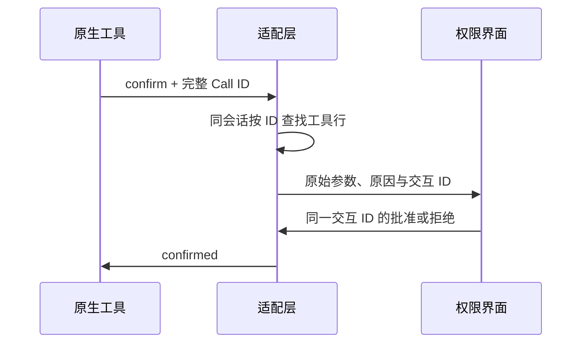

# 原生工具审批与命令可读性

## 行为与所有者

底座拥有工具执行、权限决策、超时和取消；适配层仅把原生确认请求关联到对应工具行。原生确认消息 `Call: <toolCallId>` 是关联依据，不得使用最后一行猜测，因为一批工具可能已有多个待执行行。

适配层只从同一会话、相同完整 toolCallId 的工具行读取原始 input 和显示名，写入既有 permission detail 通道。未找到行时保留原请求文本，anchor 为空；普通业务确认保持原行为。批准与拒绝仍由既有交互 ID 回到原请求，不改变执行策略，不持久化额外审批状态。

匹配的原生工具行在审批期间进入 pendingApproval，并关联 interactionId；批准后恢复运行，拒绝、取消和关闭清理等待状态。只有仍属于该交互的行可被清理，不能覆盖新的工具事件。底座最终结果仍决定成功或失败。

前端复用既有命令卡片：PowerShell 显示 `PS>`，其他 shell 保持 `$`；完整脚本保留换行和缩进，可在有限高度内滚动查看，不能用省略号截断。审批预览不显示“无输出”，因为此时命令尚未执行。终端输出保留前导空白和末尾换行，避免格式化数据展示失真。

## 验收

- 多个工具行乱序审批，命令和 anchor 均关联正确；无匹配时不能展示别的命令。
- 多行中文脚本、变量、空格与换行在审批及执行卡片中完整保留。
- 待审批不展示执行结果；允许、拒绝、停止清理仍使用原链路。
- 使用 Step Plan 有界小任务验证真实审批、输出与取消；不发布云端。
