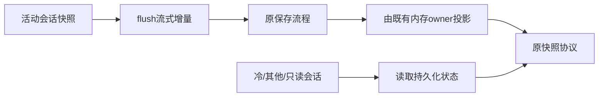

# 普通文字清理与活动会话快照优化

- 没有完整 `<tool_call>` 标记、也没有流式尾部未完标记的字符串直接原样返回。可能涉及标记时继续走原解析器，保留代码块、反引号、分片标记、错误说明及最终 strip=false 的语义；不引入增量解析状态或正文缓存。
- 活动的非只读 primary 会话发送快照时，仍先按原规则保存，再使用其内存行、内存统计与队列。去掉随后未被使用的 readConversation。冷订阅、其他会话、只读会话仍读取持久化内容；落盘失败处理、流式先flush、序号、snapshot/delta/recovery交付语义保持。

验收：普通正文与流式片段基线计时；标记/代码/普通小于号和所有前缀语义回归。快照测试覆盖活动、其他、冷、只读及保存异常，验证保存仍发生、读取数量和字段保持。运行既有流式、停止、历史及快照协议回归，用 Step Plan 小任务实际检查过程说明、工具输出、结尾与历史恢复。只改适配层，更新本机和本地Git，不发布。
