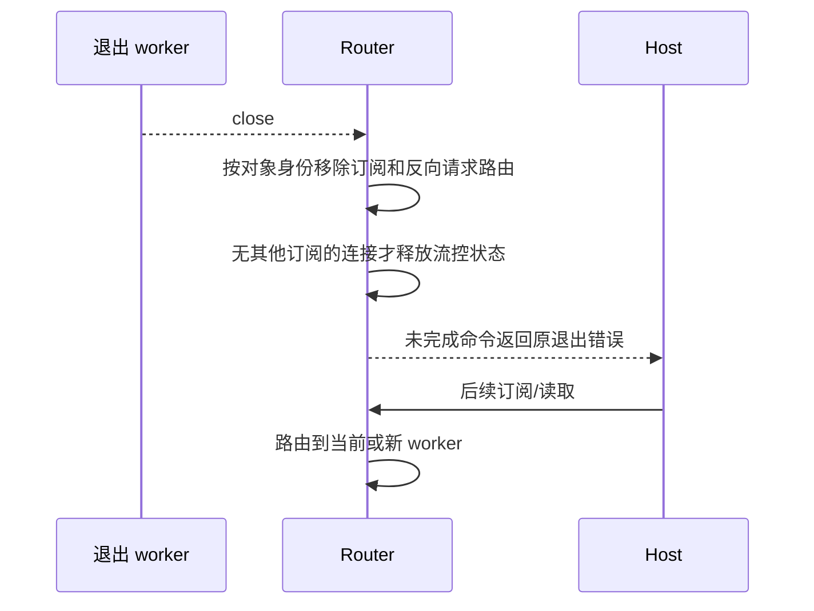

# 预览缓冲与已退出 worker 清理

UI transport 拥有一次附件读取的临时字节缓冲；Router 拥有 worker、订阅及反向 RPC 路由。底座继续通过现有文件和 RPC 契约执行，无模型配置或协议变化。

## 前端预览

对于已知总大小不超过 2MiB 的附件，在通过首块大小和偏移检查后分配最终缓冲，每块直接填入；不再保留所有分块到最后再复制。更大的附件保留原增量收集方式，避免因首块声明大体积而立即预分配大内存。空文件、短块、取消、媒体类型/总大小变化、错误偏移、提前结束和最大块数规则保持。桌面与 Web 共用此 transport，视频本地 URL 快速路径不变。

## worker 退出

只清理指向已退出对象的记录，不删除替代 worker 的记录。actor→父 sessionId 的关系保留，以便恢复时仍回到正确 owner。迟到的旧反向 RPC 响应不能写入已退出进程。共享连接的流控仍按全部存活 worker 订阅判断。close 重复执行幂等，pending 命令只失败一次。

## 验收

前端真实 transport 测试 0/小/超过2MiB、渐进写入、取消、畸形响应；worker 模拟进程退出验证释放、共享连接、迟到响应及替代 worker。候选软件用 Step Plan 小任务发送多块图片，并核对预览、下载与重启历史；自动测试覆盖异常退出，实战不故意终止用户任务。
