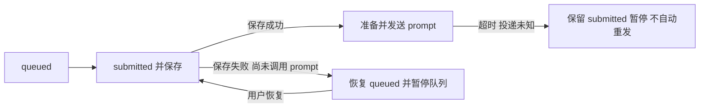

# 排队发送保存失败与文件检查

## 排队状态

session worker 的 InputLedger 仍为唯一队列 owner。发送顺序保持：queued → 内存 submitted → 保存 → 准备附件/模型 → prompt。首次保存也必须位于发送异常处理边界内。

未发送时失败恢复 queued，holdAll(error)，推送现有队列快照；用户恢复后仅发一次。已发送但超时/未知结果仍不能回退重发，明确拒绝保持旧逻辑。无新队列、定时重发或协议。桌面与手机消费同一快照。

## 文件检查

readImage 默认仍返回完整 hash/data 快照；新增可选 includeData:false，仅供内部哈希比较。预览冲突、原子替换前复查和 undo 冲突检查不生成 Base64，但每次仍读取最新文件并重新计算哈希。工具前后 checkpoint、实际恢复所需备份仍含 data。路径逐级符号链接检查、8MiB 上限、原子写和有界共享锁重试均保留，不引入文件缓存。

## 验收

- 初始保存 EBUSY/ENOSPC 时零模型请求、queued 可见且暂停；恢复后一次发送。
- 已投递超时保留 submitted，不自动重复请求。
- checkpointPreview 与原有冲突判定一致，哈希检查不进行 Base64 转换；apply/undo 恢复字节一致、外部改动仍拒绝。
- 候选软件用 Step Plan 小任务实际停止/恢复队列，以及工具写文件后撤销，覆盖前端、adapter 与原生执行。故障磁盘场景只在隔离自动测试注入。
