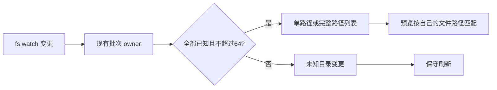

# 历史列表、预览与插件检查的重复读取优化

## 规则

1. `session/list` 一次查询中，正文只读取一次。索引校正 draft 后，可通过可选投影回调把同次读取的 session 元数据交给列表；完整正文不存入缓存，不额外驻留，返回排序、权限、模型与 limit 保持。
2. 文件监听服务保留已有 150ms 批量事件合并。一个批次有多个明确路径时，最多携带 64 个 `changedPaths`；单路径继续 `changedPath`。路径未知或超过上限时省略精确字段，客户端保守刷新。预览只在自己路径位于完整批次中时刷新；旧 Host 缺少字段、空数组和未知事件仍刷新。
3. `plugins/validate` 每次只扫描一次，ok 与 diagnostics 来自同一次结果；下一次请求重新扫描，不缓存启停或用户配置。

## 所有权与兼容

历史文件仍由 conversation store 拥有；投影回调不保存正文。文件监听仍由 workspace fileWatcher service 拥有，预览 hook 负责路径匹配与订阅生命周期；RPC 的共享 FileWatchEvent 仅添加可选字段，旧客户端忽略附加字段并保守刷新，新客户端兼容旧服务器。Desktop/remote 都走同一服务契约，不修改会话流、owner/lease 或重放协议。插件扫描仍在既有 handler 内完成，写操作与锁不变。

## 验收

自动回归验证每次 session/list 目标文件只读一次且原元数据不变；真实文件监听测试验证单路径、多个路径与超限；真实 React hook 验证无关批次不刷新、相关批次刷新、未知/旧事件刷新，路径/service 切换清理仍有效；插件检查验证单次扫描与后续请求读取新状态。最后用 Step Plan 小任务覆盖改文件、预览更新、切换历史、插件目录，统一更新本机和本地 Git，不发布云端。
