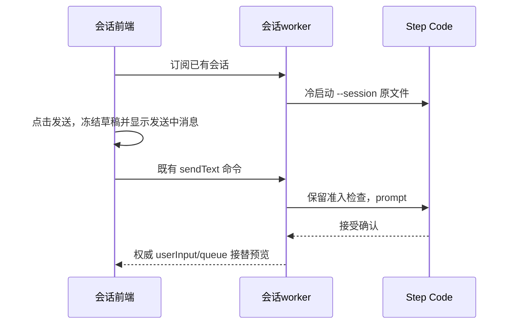

# 已有会话发送反馈与冷启动

实测重启后回到旧会话首次发送，Composer 清空等待 3,987 ms，下一次 177 ms。原生 get_commands 等待启动约 1,900 ms，紧接着 switch_session 又花约 1,450 ms；正常配置校验数十毫秒、prompt ACK 数毫秒。与模型开场输出无关。

修复：当前展示的 conversation 订阅在后台恢复对应 worker（不发模型请求），冷启动直接通过原生 `--session` 加载持久化文件，get_state 确认已经在目标会话后跳过重复 switch_session。热会话不新增重启，权限和模型准入检查保留。

前端沿用已有的发送中预览和草稿恢复契约，扩展到已有会话的普通正文发送：冻结草稿后立即清空编辑器，在消息列表底部显示“正在发送”，不伪造 accepted 或模型回复。预览由 commandId 与 sessionId 绑定，权威 userInput 或队列接替时移除；失败恢复本次草稿，不能覆盖等待期间的新输入。斜杠命令保持原交互。

验收冷恢复与热续发的发送清空时间、直接启动目标历史、模型配置不漂移、发送失败草稿恢复与新输入保护、不同会话预览隔离、排队后预览移交。不以首句出现时间代替发送确认时间。
