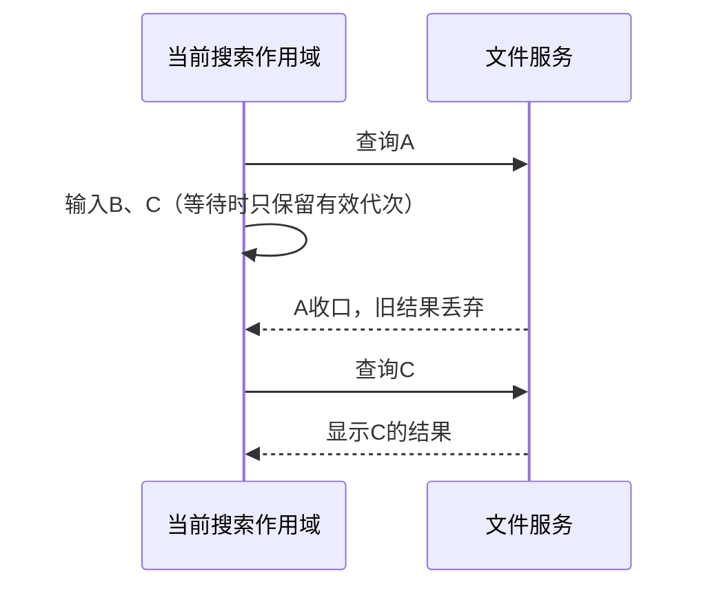

# 搜索输入调度与生成文件卡片即时校验

## 规则与所有者

- useWorkspaceFileQuery 的同一工作区/服务/启用代次最多保留一个在途检索。输入变化立即反映 loading，等当前请求收口后只执行仍有效的最新输入，跳过排队的过期输入。沿用无结果时补扫一次的规则，不以延时防抖掩盖状态问题。
- 错误属于一次查询结果；下一次输入可以重新检索，不因旧 scope.error 永久停止。过期回包和旧错误不覆盖当前输入；工作区/service 切换使用独立调度，不等待旧作用域。
- 文件卡片每次语义签名校验使用当前文件事实。checkFilesExist 新增可选 refresh，true 时绕过已有启发式 TTL 缓存及旧在途请求，直接 stat，不改写该缓存；默认调用保留原行为。前端去重路径后在既有15项上限内请求，不新增 RPC 方法。
- 卡片 hook 原有签名去重、作用域隔离和卸载清理保持；无新增轮询/跨请求缓存。旧 Host 忽略可选参数时维持原行为，新旧调用都可兼容。

## 验收

真实 React hook 回归：连续输入、错误后新查询、旧作用域未完成时切换、新结果无命中刷新、过期结果与错误。文件服务回归：不存在→创建、存在→删除、refresh 与默认缓存区分、返回顺序、15项限制；卡片校验确认发送refresh并去重路径。实际软件用订阅任务先提及不存在的文件再生成同一路径，检查文件卡片及时出现，同时验证搜索。只更新本机与本地Git。
