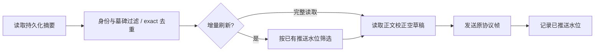

# 任务列表增量刷新只读取变化任务的正文

## 目标与事实

会话索引 `pushPersistedUpserts` 先调用 `persistedSummariesFor`，读取全部正文以校正空草稿 phase，随后按已推送 lastActivityAt 过滤。真实 QA 索引有 156 个任务：无变化刷新仍读 156 份正文、约 2 MB，约 12–13ms；历史正文更大时开销相应增长。

## 规则、所有者与边界

- `createSessionsIndex` 的现有 `pushedSummaryWatermarks` 仍是每个 topic 已推送水位的唯一所有者，不引入正文或配置缓存。
- 在工作区身份筛选、墓碑筛选、exact/legacy 去重之后，先按同一 lastActivityAt 规则选择应推送的条目，再读取这些条目的正文并执行既有空草稿校正。
- 首次订阅/强制重同步、未指定 sessionIds 的 legacy `session/list` 继续读取全部摘要对应的正文；它们不按增量水位省略条目。
- `session/list` 显式指定 sessionIds 时，在读正文之前按同一个 ID 集合筛选；空集合不读正文，非字符串/空 ID 的清理规则不变，返回排序、limit、模型与权限元数据保持原样。测试发现 160 个历史任务只查一项仍读取 161 次正文；优化为仅目标项的原有草稿校正及元数据读取。
- 无变化不读正文、不发帧、不推进 seq；变化条目按原格式推送。先发送再记水位的顺序不变。
- 缺失、损坏正文、零值/非数字 lastActivityAt 维持既有兼容规则。墓碑、大小写敏感的逻辑身份、legacy bucket 优先级和 draft 校正都不得改变。
- Desktop continuous 和 mobile replayable 使用同一索引事实；快照 deliveryKind、fromSeq/toSeq 与重放入口不变。

## 验收

自动测试覆盖首次快照、重复无变化、单条/多条变更、空草稿、墓碑、逻辑身份冲突、完整重同步及 seq 连续。以真实 QA 索引做只读前后对照，报告读取数、字节数和本地耗时；另外用 Step Plan 小任务验证新建、完成与重命名仍到达任务列表。无产品数据迁移，无底座改动。
