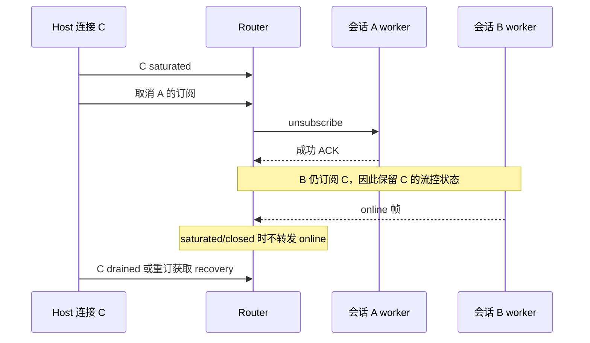

# 历史计时匹配与共享连接流控

仅修改 Harness adapter。SessionStatistics 独占统计账本；Router 独占跨 worker 的 connectionFlowStates。无新协议、底座改动、模型配置变化或持久化迁移。

## 计时匹配

恢复原生历史时，把 telemetry 按 provider、model 和 250ms 时间桶构建临时索引，只检查消息结束时间附近三个桶。保留原规则：同 provider/model，误差不超过 250ms，未用过的 eventId，最近优先，同距离按原输入顺序。无效 duration 的最近候选仍不计入，不改成挑选更远的有效候选；时长去重、工具时长和 token 账本保持。

索引只存在于一次恢复调用，不跨会话缓存。用受控长历史比较局部处理耗时与 Date.parse 次数；同时用旧匹配规则做差分，覆盖乱序、同距离、边界、无效时间/时长、不同供应商与重复 ID。

## 共享连接

取消订阅成功后，只有所有 worker 都不再持有该连接的订阅，才回收连接流控状态。取消失败则保留路由及订阅记录，允许重试。不同连接状态独立。initial/recovery 不受在线流控限制，ACK 先于同 chunk 后续 initial 的顺序不变；桌面 continuous 与手机 replayable 保持原恢复语义。

## 验收

自动回归覆盖两个会话共享连接、另一独立连接、saturated/closed/drained、失败取消后重试、最后订阅回收、initial/recovery 投递。真实软件使用 Step Plan 小任务，执行工具、切换历史、回到运行任务、完成并重启验证统计；异常流控用协议测试，不将正常模型任务当作背压压力测试。
