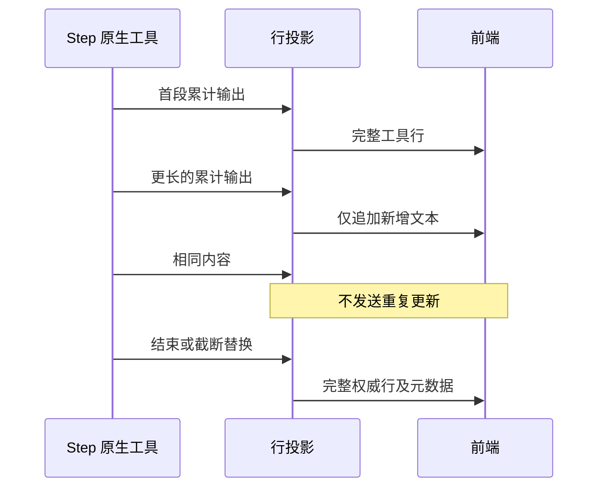

# 工具输出增量传递

- 原生累计输出仍由 StepStreamProjection 维护完整 toolCall 行。传输层不新增缓存或状态所有者。
- 首次输出、输入参数变化、运行状态变化、非前缀替换（滚动尾窗/截断/重置）使用完整行更新。
- 已运行且已有纯文本输出时，只发送新增后缀的既有 `row.delta(output.text)`；重复相同输出不发无效更新。
- 工具结束始终发送完整结果及状态、截断和完整日志元数据。取消、失败和错误文案均保留。
- 桌面连续流逐段展示；replayable 通道可按既有 profile 过滤流式输出，最终完整行必须收敛到相同结果。中途快照仍能重建当前输出，再接收后续增量。

验收：中文/Emoji 逐段无丢失重复；相同片段不发帧；前缀不匹配、参数更新和终态使用 upsert；桌面与可恢复 profile 最终结果一致；中途快照续接一致；以序列化字节量验证较大累计输出的传输减少；真实订阅执行有间隔的输出并在 UI 观察运行中及最终结果。
