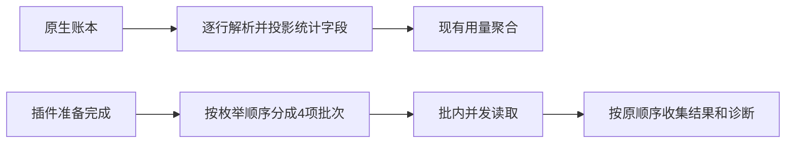

# 用量统计中间数据与插件目录读取优化

## 规则

- 原生 JSONL 仍是用量事实源，读取范围、工作区筛选、重复条目去重、时区、日期范围和损坏行处理保持。解析时仅保留统计需要的会话 ID、cwd、条目 ID、时间戳，以及消息角色、模型、usage 数值、错误状态与工具名。完整正文、思考文本、工具参数及输出不驻留在跨会话统计数组中；不修改原生文件，不缓存统计结果。
- 会话最长时长改为逐条维护最早/最晚有效时间，不累计时间数组再展开成函数参数。已复现 15 万条消息时 Math.max(...timestamps) 抛 RangeError；去重、时间范围和无有效消息时的零值保持。
- 插件扫描先完成既有官方插件准备，再分批读取独立插件目录，每批最多 4 项。每项仍按原声明/组件/用户配置读取规则执行；Promise.all 保留目录枚举顺序，错误依旧形成对应诊断，不因先完成而改变显示顺序。写操作和锁不并发化，不增加跨请求缓存。

## 边界与验收

两个改动都在适配层。用量聚合函数及 RPC 输出保持原样；插件安装/启停与目录结果仍由既有 handler 拥有。

回归比较完整日志与精简数据生成的统计完全相同，覆盖重复条目、失败/缓存/工具使用、时区、日期范围和损坏尾行。插件回归验证实际并发上限、顺序、诊断与下一次读取新状态。真实 QA 数据测量中间数据大小并比较快照哈希；再用订阅小任务与插件调用验收。只更新本机和本地 Git。
